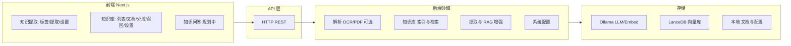

# AnythingExtract 系统架构文档

## 1. 系统概述

AnythingExtract 是一个专注于文档结构化信息提取和知识管理的本地化工具。系统采用前后端分离架构，后端使用 Python + FastAPI + LangChain，前端使用 Next.js，默认集成 Ollama 和 LanceDB 实现完全本地化部署。

### 功能亮点

- **多格式解析与可选 OCR/PDF 服务**：支持多种文档与图片格式；可选用外部 OCR/PDF 解析服务，本地回退，解析策略可配置。
- **知识库**：索引方式（高质量/经济）、分段与预处理、召回测试、知识库级设置与检索配置。
- **信息提取与 RAG 增强**：单标签、多标签与批量提取；可选标签问题增强与多查询检索，提升召回与提取效果。

### 核心功能

系统包含三大核心模块：

**1. 知识提取模块**
- **标签配置管理**：支持单选、多选、填空三种标签类型
- **文档解析**：支持 PDF/DOCX/TXT/Markdown/CSV/JSON/XLSX/PPTX/EML/JPG/JPEG/PNG；解析策略可配置为 local/server/hybrid（hybrid 先调外部服务，失败则回退本地）。
- **智能检索**：基于向量数据库和高级 RAG 方案检索相关内容
- **信息提取**：使用 LLM 根据标签配置提取结构化信息
- **结果展示**：可视化展示提取的结构化数据

**2. 知识库管理模块**
- **知识库管理**：创建、删除、重命名知识库，支持默认知识库
- **文档管理**：文档上传到知识库，按知识库组织文档
- **文档状态跟踪**：在知识库中查看文档处理状态
- **知识库检索**：支持按知识库名称搜索

**3. 知识问答模块**（规划中）
- **基于知识库的问答**：基于知识库内容进行智能问答
- **对话管理**：管理问答历史记录

### 技术栈

**后端**：Python 3.10+ / FastAPI / LangChain / SQLite / LanceDB / Ollama  
**前端**：Next.js 14+ / TypeScript / Tailwind CSS  
**包管理**：pip / npm

## 2. 系统架构



## 3. 核心模块

### 3.1 标签配置模块

支持三种标签类型：
- **单选** (`single_choice`)：从预定义选项中选择一个
- **多选** (`multiple_choice`)：从预定义选项中选择多个
- **填空** (`text_input`)：自由文本输入

标签配置存储在 SQLite 数据库中，包含名称、类型、描述、可选项、是否必填等字段。

**标签管理流程**：前端发起 CRUD 请求（创建/查询/更新/删除）→ 后端校验并写库 → 返回结果；不存在时返回 404。

### 3.2 知识库管理模块

知识库模块按统一数据集规范扩展，并在本地部署场景做了简化（无租户字段）。

**KnowledgeBase 核心字段**：
- `indexing_technique`: `high_quality | economy`
- `doc_form`: `text_model | qa_model | hierarchical_model`
- `embedding_model` / `embedding_model_provider`
- `keyword_number`
- `retrieval_model`（JSON，包含 `search_method/top_k/score_threshold/reranking` 等）

**知识库流程**：
1. 创建知识库（`POST /api/knowledge-bases`）时初始化默认检索配置和默认 process rule。
2. 初始化创建（`POST /api/knowledge-bases/init`）支持一次性创建知识库 + 批量文档入队。
3. 更新知识库（`PATCH /api/knowledge-bases/{id}`）支持切换 `indexing_technique`、检索配置和 embedding 配置。
4. 切换经济/高质量模式时不删除历史索引数据，支持向量与关键词并存。

**默认知识库策略**：
- 系统启动时自动补齐默认知识库与默认 process rule。
- 仅剩最后一个知识库时禁止删除。

**前端知识库界面**：
- 文档详情：文档处于索引进度中（parsing/cleaning/splitting/indexing 等）时展示索引进度视图并轮询 `indexing-status`；完成后展示分段列表与元数据面板。
- 文档处理流程：上传后可进入独立处理页，步骤为选择数据源 → 文本分段与清洗 → 处理并完成；分段设置与预览、主按钮「保存并处理」触发 reindex 入队；完成后展示嵌入与配置摘要。
- 分段设置：左栏为分段与预处理规则、索引方式（高质量/经济）、检索设置；右栏为预览（预估块数、预览块）。后端提供 `POST /knowledge-bases/{id}/documents/{docId}/preview-chunks` 按当前或传入规则预览分段结果。
- 召回测试：左侧为查询输入与检索设置、测试与历史；右侧为召回结果；检索方式与 Top K/Score 阈值在抽屉内配置。
- 知识库设置：名称与图标、分段结构（只读展示）、索引方式（高质量/经济及关键词数量）、Embedding 只读、检索方式与参数、保存。

### 3.3 文档处理模块

文档处理链路采用 `Extract -> Transform -> Load Segments -> Load` 四阶段流程，并兼容现有异步队列。

**入口**：
- `POST /api/documents/upload`：上传文件并创建 `Document`，支持 `queue | immediate` 两种处理模式。
- `POST /api/knowledge-bases/{id}/documents`：按本地文件路径创建文档并入队。
- `POST /api/knowledge-bases/init`：创建知识库后批量创建文档并入队。

**索引主流程**：Extract（按数据源读取并解析）→ Transform（预处理与分段）→ Load Segments（写入分段表）→ Load（向量与关键词双写，经济/高质量可切换并复用已有数据）。

**状态模型**：
- `Document.status`：`queued/processing/completed/failed`（兼容历史队列状态）。
- `Document.indexing_status`：`waiting/parsing/cleaning/splitting/indexing/completed/error`。
- `DocumentSegment.status`：`waiting/indexing/completed/re_segment/error`。

**处理规则（Process Rule）**：
- 每个知识库至少有一条默认规则（`knowledge_base_process_rules`）。
- 支持 `automatic/custom/hierarchical` 模式及 `pre_processing_rules + segmentation` 配置。

### 3.4 向量化模块

**向量化流程**：输入文档分段 → 按内容校验缓存 → 未命中则调用 Embedding 生成向量并写缓存 → 写入向量库（向量 + 文本 + 元数据）。

### 3.5 检索模块

检索模块支持多检索方法分发，并保留本地化实现。

**支持的方法**：
- `semantic_search`（向量检索）
- `full_text_search`（向量库全文检索，调用 `search_by_full_text`）
- `hybrid_search`（向量 + 全文合并加权）
- `keyword_search`（Jieba 倒排）
- `basic`（兼容入口，内部映射为 `semantic_search`）

**检索配置来源**：
- 优先使用请求携带的 `retrieval_model`。
- 未传时回退到 `KnowledgeBase.retrieval_model`。
- 生效参数包括：`search_method/top_k/score_threshold/reranking_enable`。

**过滤规则**：
- 只返回 `DocumentSegment.enabled = true` 且 `DocumentSegment.status = completed` 的分段。
- 只返回 `Document.enabled = true` 且 `Document.archived = false` 的文档分段。

**命中统计**：
- 每次检索后自动累加 `DocumentSegment.hit_count`。

### 3.6 信息提取模块

**提取流程**（单标签 / 多标签 / 批量共用主流程）：
1. 验证标签与文档（不存在或未完成则 404/400）。
2. 构建查询（基础查询；可选 RAG 增强为多问句）。
3. 检索相关片段（多标签时多查询检索后按片段去重取最高相似度）。
4. 按标签类型构建 Schema 与 Prompt，填入片段后调用 LLM。
5. 解析并校验结果，组装来源信息后返回。

差异：多标签为多查询检索后合并再一次 LLM 多字段输出；批量为遍历文档逐份执行单标签提取并汇总结果。

## 4. 数据模型

### 4.1 数据库设计

核心数据表按统一知识库模型扩展（SQLite，启动时自动迁移）。

| 表 / 概念 | 主要用途 |
|-----------|----------|
| `knowledge_bases` | 知识库元信息、索引方式、检索与 embedding 配置 |
| `knowledge_base_process_rules` | 每知识库的预处理与分段规则（JSON） |
| `knowledge_base_keyword_tables` | 经济模式关键词倒排（关键词 → 分段） |
| `documents` | 文档数据源、索引状态与进度、可用性（启用/归档） |
| `document_segments` | 分段内容、索引与状态、命中统计 |
| `tag_configs` | 标签配置（类型、描述、可选项） |
| `extraction_results` | 提取结果与来源 |
| `document_vectors` / `document_ingest_jobs` | 向量映射与入队任务（兼容与队列） |

### 4.2 数据流

**文档处理**：原始文件 → 文档记录与解析结果 JSON → 分段 → 向量/关键词索引（含缓存）→ 向量库与数据库。

**信息提取**：标签配置 + 文档/向量 → 构建查询（可选 RAG 增强）→ 检索片段 → 构建 Prompt + LLM → 结构化结果 → 写入提取结果。

### 4.3 存储结构

`storage` 下主要用途：数据库文件（SQLite）；解析结果文档；上传原始文件；向量缓存（按内容 hash）；LanceDB 向量库目录。

### 4.4 数据关系

- 知识库 1:N 文档（一个知识库包含多个文档）
- 文档 1:N 分段 / 向量映射 / 提取结果
- 标签配置 1:N 提取结果

## 5. API 接口

### 5.1 标签管理 API

**获取所有标签**
- `GET /api/tags`
- 响应: `{ success: true, data: { tags: [...] } }`

**获取单个标签**
- `GET /api/tags/{id}`
- 响应: `{ success: true, data: { tag: {...} } }`

**创建标签** `POST /api/tags`
- 请求体：`name`、`type`、`description`、`options`、`required` 等字段。
- 响应：返回创建后的标签对象。

**更新标签** `PUT /api/tags/{id}`
- 请求体：同上，各字段可选。
- 响应：返回更新后的标签对象。

**删除标签**
- `DELETE /api/tags/{id}`
- 响应: `{ success: true, message: "标签已删除" }`

### 5.2 知识库管理 API

**知识库接口**：
- `GET /api/knowledge-bases`
  - 支持 `keyword` 和兼容参数 `search`，并支持分页 `page/limit`
- `GET /api/knowledge-bases/{id}`
  - 返回知识库详情（含 `indexing_technique/doc_form/retrieval_model/embedding_model`）
- `POST /api/knowledge-bases`
  - 创建知识库并初始化默认 process rule
- `POST /api/knowledge-bases/init`
  - 一次性创建知识库 + 批量创建文档 + 返回 `batch` 批次号
- `PATCH /api/knowledge-bases/{id}` / `PUT /api/knowledge-bases/{id}`
  - 更新知识库配置，支持检索方式和索引模式切换
- `DELETE /api/knowledge-bases/{id}`
  - 删除知识库（最后一个知识库禁止删除）

**知识库文档与检索相关接口**：
- `GET /api/knowledge-bases/{id}/documents` / `POST /api/knowledge-bases/{id}/documents`
- `PATCH /api/knowledge-bases/{id}/documents/status/{action}/batch` — 文档批量状态
- `GET /api/knowledge-bases/{id}/batch/{batchId}/indexing-status` — 批次索引进度
- `POST /api/knowledge-bases/{id}/hit-testing` — 召回测试
- `GET /api/knowledge-bases/{id}/queries` — 查询记录

### 5.3 文档管理 API

**通用文档接口**（按全局 `document_id` 访问，当前假定单租户/单用户场景，不强制携带 `knowledge_base_id`）：
- `POST /api/documents/upload`
  - 支持 `processing_mode=queue|immediate` 与 `batch` 参数
- `GET /api/documents`
- `GET /api/documents/{document_id}`
- `GET /api/documents/{document_id}/status`
- `POST /api/documents/{document_id}/retry`
- `DELETE /api/documents/{document_id}`
  - 说明：删除文档记录、原始文件、JSON 文件和向量数据；若未来引入多知识库/多租户隔离，可在 service 层增加文档归属或权限校验。

**知识库文档详情接口**：
- `GET /api/knowledge-bases/{id}/documents/{docId}` — 文档详情
- `PATCH /api/knowledge-bases/{id}/documents/{docId}/name` — 更新文档名
- `PATCH /api/knowledge-bases/{id}/documents/{docId}/settings` — 更新文档设置
- `POST /api/knowledge-bases/{id}/documents/{docId}/preview-chunks` — 按当前或传入规则预览分段
- `POST /api/knowledge-bases/{id}/documents/{docId}/reindex` — 重新入队索引（process 页「保存并处理」）
- `GET /api/knowledge-bases/{id}/documents/{docId}/indexing-status` — 索引进度等
- `GET /api/knowledge-bases/{id}/documents/{docId}/segments` — 分段列表
- `POST /api/knowledge-bases/{id}/documents/{docId}/segment` — 分段操作
- `DELETE /api/knowledge-bases/{id}/documents/{docId}/segments` — 删除分段
- `PATCH /api/knowledge-bases/{id}/documents/{docId}/segments/{segId}` — 更新分段（content/answer/keywords/enabled）
- `PATCH /api/knowledge-bases/{id}/documents/{docId}/segment/{action}?segment_id=...` — 分段批量启用/禁用

**状态操作说明**：
- 文档支持 `enable/disable/archive/un_archive` 批量状态变更。
- 归档文档不可编辑分段、不可重试索引（需先取消归档）。

**删除文档**
- `DELETE /api/documents/{id}`
- 说明: 删除文档记录、原始文件、JSON 文件和向量数据
- 响应: `{ success: true, message: "文档已删除" }`

### 5.4 信息提取 API

**单标签提取** `POST /api/extract`
- 必填：`tag_config_id`、`document_id`。
- 可选：`retrieval_method`（默认 basic）、`top_k`、`rerank`、`rag_enhancement_enabled`、`rag_tag_enhancements`。
- 响应：成功时 `data` 含 `result`、`sources`、`extraction_time`。

**多标签提取** `POST /api/extract/multi-tags`
- 必填：`tag_config_ids`、`document_id`。
- 可选：同上；响应含多标签 `result`、各标签的 `query_bundle`/`retrieval_results`、`sources`、`extraction_time`。

**标签 RAG 增强（问题生成）** `POST /api/extract/rag/enhance-tags`
- 必填：`tag_config_ids`。
- 可选：`question_count`、`strategy`。
- 响应：各标签的增强问题与 `base_query` 等（`tag_enhancements`、`strategy`）。

**批量提取** `POST /api/extract/batch`
- 必填：`tag_config_id`、`document_ids`。
- 可选：`retrieval_method`、`top_k`。
- 响应：`data.results` 为每文档的 `result`/`sources` 或 `error` 列表。

### 5.5 系统配置 API

**获取系统配置**
- `GET /api/system/config`
- 响应: `{ success: true, data: { config: {...} } }`

**更新系统配置**
- `PUT /api/system/config`
- 请求体: 配置对象
- 响应: `{ success: true, data: { config: {...} }, message: "配置更新成功" }`

### 5.6 API 响应格式

所有 API 响应遵循统一格式：

```typescript
interface ApiResponse<T> {
  success: boolean;      // 请求是否成功
  data?: T;             // 响应数据 (成功时)
  message?: string;     // 消息 (可选)
  error?: string;       // 错误信息 (失败时)
}
```

错误响应示例：
```json
{
  "success": false,
  "error": "文档不存在"
}
```

## 6. 快速安装

### 前置要求

- Python 3.10+
- Node.js 18+ 和 npm
- Ollama（可选但推荐）

### 安装步骤

```bash
# 1. 使用安装脚本（推荐）
./install.sh  # Linux/Mac
install.bat   # Windows

# 2. 或手动安装
cd backend
python -m venv .venv
source .venv/bin/activate  # Linux/Mac
# 或 .venv\Scripts\activate  # Windows
pip install -r requirements.txt

cd ../frontend
npm install

# 3. 配置环境变量
cp backend/.env.example backend/.env
# 编辑 backend/.env
```

### 启动服务

```bash
./start.sh    # Linux/Mac
start.bat     # Windows
```

访问：
- 前端：http://localhost:3001
- 后端 API：http://localhost:8888
- API 文档：http://localhost:8888/docs

## 7. 环境配置

编辑 `backend/.env`：

```env
# LLM 配置
OLLAMA_BASE_URL=http://localhost:11434
OLLAMA_MODEL=llama2
OLLAMA_EMBEDDING_MODEL=nomic-embed-text

# 向量数据库
LANCE_DB_PATH=./storage/lancedb

# 应用配置
API_HOST=0.0.0.0
API_PORT=8888
FRONTEND_URL=http://localhost:3001

# 数据库
DATABASE_URL=sqlite:///./storage/database.db
```

## 8. 完整业务流程

### 8.1 系统初始化流程

1. 启动应用与 lifespan
2. 初始化存储目录与数据库表
3. 注册 API 路由与 CORS 中间件
4. 应用就绪

### 8.2 典型使用流程

**1. 配置标签**：用户在前端创建标签 → 前端 POST 标签 API → 后端校验并写库 → 返回结果。

**2. 上传文档**：用户上传文件 → 前端 POST 上传 API → 后端创建文档记录并返回 → 前端展示上传成功。

**3. 后台处理文档**（异步）：后端启动处理任务 → 解析与分块 → 保存文档 JSON → 向量化并写向量库 → 更新文档状态为已完成。

**4. 执行信息提取**：用户选择标签与文档 → 前端（可选）请求 RAG 增强问题 → 前端 POST 提取 API → 后端检索片段、构建 Prompt、调用 LLM、解析结果 → 返回提取结果与来源。

### 8.3 文档与提取详细流程

文档处理主流程见 **§3.3 文档处理模块**，信息提取主流程见 **§3.6 信息提取模块**。

## 9. Provider 抽象层设计

系统采用 Provider 抽象层设计，便于替换底层实现。

### 9.1 LLM Provider

**接口**：`generate`（同步生成）、`generate_stream`（流式生成）。

**Ollama 实现**：调用 Ollama API，支持流式与非流式；配置 `OLLAMA_BASE_URL`、`OLLAMA_MODEL`。

**扩展**：实现基类接口，在服务层通过配置或依赖注入切换实现。

### 9.2 Embedding Provider

**接口**：`embed(texts)`，返回向量列表。

**Ollama 实现**：调用 Ollama Embedding API；配置 `OLLAMA_EMBEDDING_MODEL`。

**扩展**：实现基类接口，在检索与向量化服务层通过配置或依赖注入切换。

### 9.3 VectorDB Provider

**接口**：`add_documents`（写入向量与元数据）、`search`（按查询向量与 top_k 检索）。

**LanceDB 实现**：本地 LanceDB 存储，支持相似度搜索与元数据过滤。

**扩展**：实现基类接口，在检索与向量化服务层通过配置或依赖注入切换。

### 9.4 Provider 使用流程

服务层通过基类接口调用 Provider（LLM / Embedding / VectorDB）；当前实现为 Ollama 与 LanceDB，可按接口替换为其他实现（如 OpenAI、ChromaDB 等）而不改动服务层代码。

## 10. 扩展性设计

### 10.1 扩展 RAG 增强策略（推荐）

当前检索层固定为 `basic`，高级 RAG 能力通过“标签增强层”扩展：在 RAG 增强服务中注册新策略类，前端通过 `POST /api/extract/rag/enhance-tags` 的 `strategy` 参数选择，可在不改动提取主流程的前提下引入更多 RAG 方法。

### 10.1.1 Query Bundle 数据契约

每个标签在提取结果中可返回 `query_bundle`，用于前端展示与扩展。契约包含：`base_query`（标签原始查询）、`enhanced_questions`（RAG 增强生成的问题）、`queries`（实际参与检索的查询列表，去重后）。

### 10.2 添加新的文档格式

在文档解析器中增加新格式分支，并在上传与 API 层允许对应类型；解析输出与现有页面/分段结构一致即可接入流水线。

### 10.3 添加新的标签类型

扩展数据模型中的标签类型枚举、提取 Prompt 中的 Schema 构建逻辑及前端对该类型的展示与编辑。

## 11. 模块与职责

具体文件与目录结构以代码仓库为准，本文档仅描述模块划分与职责。

**前端（按路由/功能模块）**：
- **知识提取**：标签管理（`/tags`）、信息提取（`/extract`）、系统设置（`/settings`，含解析与 OCR/PDF 配置）。
- **知识库**：知识库列表与创建、文档管理、文档处理流程（分段与预览、保存并处理）、召回测试、知识库设置。
- **知识问答**：`/qa`（规划中）。
- **全局文档视图**：`/documents`（可选入口）。

**后端（按层/领域）**：
- **API 路由**：标签、知识库、文档、提取、系统配置等 REST 接口。
- **核心服务**：文档解析（含多格式与可选 OCR/PDF）、向量化与检索、知识库入队与索引、信息提取与 RAG 增强。
- **Provider 抽象**：LLM、Embedding、VectorDB，可替换实现。
- **核心数据与存储**：配置与数据库在 `core`，业务模型与持久化在对应服务层；队列与 worker 负责异步入队与处理。

### 11.1 说明

入口与路由在应用层，业务逻辑在服务层，数据模型与存储访问在核心层；扩展新格式、新标签或新 Provider 时在对应模块中增加分支或实现即可。

## 12. 常见问题

**Q: Ollama 连接失败**  
A: 确保 Ollama 服务正在运行：`ollama serve`

**Q: 文档处理失败**  
A: 检查文档格式是否支持，查看后端日志获取详细错误信息

**Q: 向量数据库错误**  
A: 检查 LanceDB 路径配置，确保有写入权限

**Q: pip 命令未找到**  
A: pip 通常随 Python 一起安装，如未找到：`python -m ensurepip --upgrade`

