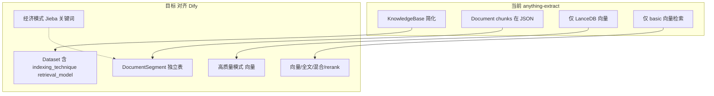

# 知识库对齐 Dify 实施方案

## 功能覆盖检查（用户需求 vs 方案支持）


| 功能             | 方案支持 | 实现位置                                                       |
| -------------- | ---- | ---------------------------------------------------------- |
| 文档启用/禁用        | 支持   | 2.4 节 Document.enabled + PATCH status/disable              |
| 文档归档           | 支持   | 2.4 节 Document.archived + PATCH status/archive             |
| 召回测试           | 支持   | 2.7 节 POST hit-testing，3.2 节 hit-testing 页面                |
| 经济模式倒排 + Top K | 支持   | 2.2 节 Jieba 关键词索引，retrieval_model.top_k                    |
| 高质量向量检索        | 支持   | 2.3 节 semantic_search                                      |
| 高质量全文检索        | 支持   | 2.6 节 向量库 search_by_full_text（LanceDB FTS 或可选 ES/Weaviate） |
| 高质量混合检索        | 支持   | 2.3 节 向量+全文/关键词两路合并                                        |
| 经济/高质量自由切换     | 支持   | 2.5 节 双索引并存，切换不删数据                                         |
| Embedding 模型选择 | 支持   | 2.8 节、2.9 节；默认 nomic-embed-text                            |


---

## 2.8 Embedding 模型选择（对齐 Dify ModelSelector）

**Dify 设计**：创建知识库/设置页中，高质量模式显示 `ModelSelector` 选择 embedding 模型（[indexing-section.tsx](dify/web/app/components/datasets/settings/form/components/indexing-section.tsx) 约 132-147 行）。

**anything-extract 实现**：

- **保留模型选择 UI 位置**：抄写 Dify 的 `ModelSelector`（或简化版），在知识库创建向导 Step 2、知识库设置页的 IndexingSection 中展示。
- **默认值**：`embedding_model_provider = "ollama"`，`embedding_model = "nomic-embed-text"`。
- **现阶段**：仅支持 Ollama 单一供应商，固定使用 `nomic-embed-text`；ModelSelector 可展示该默认值，或从 `KnowledgeBase.embedding_model` / 全局配置读取。
- **后续预留**：参考 Dify 引入多供应商（OpenAI、Azure 等），需扩展 `ModelManager` / embedding provider 抽象，届时再接入。

**KnowledgeBase 字段**（已在 2.1）：`embedding_model`、`embedding_model_provider`。向量化时从 `KnowledgeBase` 读取，若为空则回退到全局 `OLLAMA_EMBEDDING_MODEL`。

---

## 2.9 后续预留：模型供应商扩展

- **预留项**：参考 Dify 的 ModelManager、Provider 体系，支持多 embedding 供应商（Ollama、OpenAI、Azure、国产 API 等）。
- **现阶段不实现**：知识库向量化仅使用 Ollama，默认 `nomic-embed-text`。
- **实现时可参考**：`dify/api/core/model_manager.py`、`dify/api/core/rag/embedding/`、前端 `ModelSelector` 的 provider 切换逻辑。

---

## 一、现状与目标对照




| 维度   | 当前 anything-extract                 | Dify 目标                                                                                   |
| ---- | ----------------------------------- | ----------------------------------------------------------------------------------------- |
| 知识库表 | `knowledge_bases`（name, is_default） | `Dataset`（indexing_technique, doc_form, retrieval_model, embedding_model, keyword_number） |
| 分块存储 | chunks 在 `documents/{id}.json`      | `DocumentSegment` 独立表（position, content, answer, keywords, index_node_id）                 |
| 索引方式 | 仅向量                                 | 经济（Jieba 倒排）+ 高质量（向量）                                                                     |
| 分块模式 | 单一 TextSplitter                     | text_model / qa_model / hierarchical_model                                                |
| 检索   | basic 向量                            | semantic / full_text / hybrid / keyword + reranking                                       |


---

## 二、后端改造（严格参考 dify）

### 2.1 数据模型扩展

**文件**：[backend/core/database.py](anything-extract/backend/core/database.py)

**KnowledgeBase → 扩展为类似 Dataset**（保留 `knowledge_bases` 表名，本地无租户可简化）：

```python
# 新增字段（参考 api/models/dataset.py 45-83 行）
indexing_technique = Column(String)      # "high_quality" | "economy"
doc_form = Column(String, default="text_model")  # text_model | qa_model | hierarchical_model
embedding_model = Column(String)
embedding_model_provider = Column(String)
keyword_number = Column(Integer, default=10)
retrieval_model = Column(Text)           # JSON: RetrievalConfig
```

**新建 DocumentSegment 表**（参考 [dify/api/models/dataset.py](dify/api/models/dataset.py) 700-741 行）：

```python
class DocumentSegment(Base):
    __tablename__ = "document_segments"
    id = Column(String, primary_key=True)
    document_id = Column(String, ForeignKey("documents.id"))
    knowledge_base_id = Column(String)
    position = Column(Integer)
    content = Column(Text)
    answer = Column(Text)          # Q&A 模式
    word_count = Column(Integer)
    tokens = Column(Integer)
    keywords = Column(Text)        # JSON 数组，经济模式
    index_node_id = Column(String)
    index_node_hash = Column(String)
    hit_count = Column(Integer, default=0)
    enabled = Column(Boolean, default=True)
    disabled_at = Column(DateTime)
    disabled_by = Column(String)
    status = Column(String, default="waiting")  # waiting/completed/re_segment
```

注：Dify 父子分段用独立表 `ChildChunk`（segment_id 指向父段），非 parent_id。若实现 hierarchical 模式，需新建 `ChildChunk` 表。

**新建 DatasetKeywordTable 等价表**（经济模式倒排，[dify/api/models/dataset.py](dify/api/models/dataset.py) 641-692 行）：

```python
class KnowledgeBaseKeywordTable(Base):
    __tablename__ = "knowledge_base_keyword_tables"
    knowledge_base_id = Column(String, primary_key=True)
    keyword_table = Column(Text)   # JSON: {"关键词": ["index_node_id", ...]}
```

**Document 扩展**（对齐 [dify/api/models/dataset.py](dify/api/models/dataset.py) Document 354-425 行）：

```python
doc_form = Column(String, default="text_model")
doc_language = Column(String, default="English")
data_source_type = Column(String)      # upload_file
data_source_info = Column(Text)       # JSON，存 {"file_path": "..."} 或 {"upload_file_id": "..."}
indexing_status = Column(String)       # waiting/parsing/cleaning/splitting/indexing/completed/error
process_rule_id = Column(String)       # 关联处理规则
batch = Column(String)                 # 批量上传分组，用于 GET batch/{batchId}/indexing-status
position = Column(Integer)             # 在 batch 中的顺序
created_from = Column(String)          # "upload_file" | "notion_import" | "website_crawl"
is_paused = Column(Boolean)            # 暂停索引
```

**新建 KnowledgeBaseProcessRule 表**（对齐 [dify DatasetProcessRule](dify/api/models/dataset.py) 315-329 行）：

```python
class KnowledgeBaseProcessRule(Base):
    __tablename__ = "knowledge_base_process_rules"
    id, knowledge_base_id, mode, rules(Text), created_at
    # mode: "automatic" | "custom" | "hierarchical"
    # rules JSON 结构（对齐 knowledge_entities Rule）：
    #   pre_processing_rules: [{id: "remove_extra_spaces"|"remove_urls_emails"|"remove_stopwords", enabled: bool}]
    #   segmentation: {separator, max_tokens, chunk_overlap}
    #   parent_mode, subchunk_segmentation（hierarchical 时）
```

### 2.2 索引流程改造（抄写 IndexingRunner）

**可复用/抄写来源**：

- [dify/api/core/indexing_runner.py](dify/api/core/indexing_runner.py)：主流程 `run` → Extract → Transform → Load Segments → Load
- [dify/api/core/rag/cleaner/clean_processor.py](dify/api/core/rag/cleaner/clean_processor.py)：`CleanProcessor.clean` 按 pre_processing_rules 清洗（remove_extra_spaces、remove_urls_emails）
- [dify/api/core/rag/index_processor/processor/paragraph_index_processor.py](dify/api/core/rag/index_processor/processor/paragraph_index_processor.py)：text_model
- [dify/api/core/rag/datasource/keyword/jieba/jieba.py](dify/api/core/rag/datasource/keyword/jieba/jieba.py)：经济模式 create/search
- [dify/api/core/rag/datasource/vdb/vector_factory.py](dify/api/core/rag/datasource/vdb/vector_factory.py)：高质量向量写入

**本地适配要点**：

- anything-extract 用 LanceDB，Dify 的 Vector 工厂需适配为 `LanceDBProvider` 调用
- 无 Celery：用 `asyncio.create_task` 或沿用现有 `ingest_worker` 调用 `IndexingRunner`
- 无 tenant_id：用固定值或省略
- **_extract 数据源**：Dify 的 `upload_file` 从 `UploadFile` 表取文件；anything-extract 无此表，`data_source_info` 存 `{"file_path": "..."}`，从本地路径读取并复用 `DocumentParser.parse`

**实现步骤**：

1. 抄写 `CleanProcessor`，在 `_transform` 分块前调用
2. 新建 `backend/core/indexing_runner.py`：拷贝 `IndexingRunner`，`_extract` 的 upload_file 分支从 file_path 读取
3. 新建 `backend/core/rag/` 目录结构：`index_processor`、`datasource/keyword/jieba`、`cleaner`
4. 集成到 `document_ingest_service.py`：流程改为 `_extract`（适配 file_path）→ `_transform`（CleanProcessor + 分块）→ `_load_segments` → `_load`

### 2.3 检索流程改造

**可复用来源**：

- [dify/api/core/rag/datasource/retrieval_service.py](dify/api/core/rag/datasource/retrieval_service.py)：`RetrievalService.retrieve` 分发
- [dify/api/core/rag/datasource/keyword/jieba/jieba.py](dify/api/core/rag/datasource/keyword/jieba/jieba.py)：`search` 方法

**本地适配**：

- 高质量：沿用 `RetrievalService` + 向量库 Provider，增加 `score_threshold`、`reranking` 占位
- 经济：新增 `KeywordSearchService`，调用 Jieba `search`，返回 `DocumentSegment`
- **全文检索**：按 Dify 设计，由**向量库**的 `search_by_full_text` 提供（见 2.6）；`RetrievalService.full_text_index_search` 调用 `vector.search_by_full_text`
- 混合检索：`embedding_search` + `full_text_index_search` 两路并发，去重后加权或 Rerank

### 2.4 文档启用/禁用/归档（严格对齐 Dify）

**Document 模型新增字段**（参考 [dify/api/models/dataset.py](dify/api/models/dataset.py) 409-415 行）：

```python
enabled = Column(Boolean, default=True)
disabled_at = Column(DateTime)
disabled_by = Column(String)
archived = Column(Boolean, default=False)
archived_reason = Column(String)
archived_by = Column(String)
archived_at = Column(DateTime)
```

**DocumentSegment** 需有 `enabled` 字段；检索时过滤 `enabled=True` 的 segment。Dify 还支持 **Segment 级别** enable/disable（`PATCH .../segment/{action}?segment_id=xxx`），更新 DB 后检索即生效；若需同步更新向量库/关键词表，可参考 `enable_segments_to_index_task` / `disable_segments_from_index_task`。

**API**（参考 [dify/api/controllers/console/datasets/datasets_document.py](dify/api/controllers/console/datasets/datasets_document.py) 1039-1074 行）：

- `PATCH /api/knowledge-bases/{id}/documents/status/{action}/batch?document_id=xxx&document_id=yyy`
- `action`：`enable` | `disable` | `archive` | `un_archive`

**业务规则**：归档文档不可编辑、不可重新索引；启用/禁用仅影响检索是否包含该文档。

### 2.5 经济/高质量模式自由切换与数据保留（超越 Dify）

**Dify 现状**：经济 → 高质量可升级（需重新索引），高质量 → 经济**不可**（前端禁用 economy 选项）。切换时 Dify 会删除/覆盖旧索引。

**目标**：支持自由切换，且**双索引并存**，切换时**不删除**已有数据。

**数据模型策略**：

- 每个知识库同时维护（若已生成）：
  - **向量数据**：LanceDB（按 knowledge_base_id 分表或 document_id 过滤）
  - **关键词倒排**：`KnowledgeBaseKeywordTable`
- `indexing_technique` 仅表示**当前检索使用的模式**，不表示数据是否存在
- 切换时：只更新 `KnowledgeBase.indexing_technique` 和 `retrieval_model`，**不**删向量、不删 KeywordTable

**索引写入策略**：

- 新文档添加时，根据 `indexing_technique` 决定本次写入向量或关键词（或两者都写，见下）
- **推荐**：无论当前模式，**同时写入向量和关键词**（双写），这样切换时无需重建索引。经济模式仅用关键词检索，高质量仅用向量；若需节省存储可改为按当前模式单写，切换时触发「补齐另一套索引」的后台任务。

### 2.6 全文检索实现方案（严格对齐 Dify）

**Dify 设计结论**（基于源码调研）：

- Dify **不单独安装 ES**：默认 `VECTOR_STORE=weaviate`，Weaviate 同时存储向量与文本，`col.query.bm25()` 提供 BM25 全文检索（[docker-compose.yaml](dify/docker/docker-compose.yaml) 159 行、717-740 行；[weaviate_vector.py](dify/api/core/rag/datasource/vdb/weaviate/weaviate_vector.py) 395-433 行）
- **全文检索由向量库实现**：`BaseVector` 定义 `search_by_full_text`，各 Provider 自行实现或返回 `[]`（[vector_base.py](dify/api/core/rag/datasource/vdb/vector_base.py) 44-46 行）
- **RetrievalService** 调用 `vector.search_by_full_text`，不依赖独立全文服务（[retrieval_service.py](dify/api/core/rag/datasource/retrieval_service.py) 344-346 行）
- ES 为**可选**：`VECTOR_STORE=elasticsearch` 时启动 ES 容器（`profiles: elasticsearch`），ES 同时承担向量与 BM25

**anything-extract 实现**（与 Dify 一致）：

- 向量库 Provider 实现 `search_by_full_text`，高质量模式的全文/混合检索通过 `vector.search_by_full_text` 完成
- 按 `VECTOR_STORE` 配置选择实现；不支持全文的库（如 Chroma）返回 `[]`

**可选项与抄写来源**：


| VECTOR_STORE      | 全文能力 | 抄写来源                                                                                                                | 抄写要点                                                                                                                                                                               |
| ----------------- | ---- | ------------------------------------------------------------------------------------------------------------------- | ---------------------------------------------------------------------------------------------------------------------------------------------------------------------------------- |
| **lancedb**（默认）   | 支持   | LanceDB 无 Dify 实现，参考 [Weaviate 395-433 行](dify/api/core/rag/datasource/vdb/weaviate/weaviate_vector.py) 的 BM25 调用模式 | `add_texts` 后对 text 列调用 `table.create_fts_index("text")`；`search_by_full_text` 用 `table.search(query).limit(top_k)`（[LanceDB FTS 文档](https://lancedb.com/docs/indexing/fts-index)） |
| **elasticsearch** | 支持   | [elasticsearch_vector.py](dify/api/core/rag/datasource/vdb/elasticsearch/elasticsearch_vector.py) 全文件               | `search_by_full_text` 227-250 行：`match` 查询 `Field.CONTENT_KEY`；需 `ELASTICSEARCH_HOST/PORT/USERNAME/PASSWORD`；docker 见 1028-1057 行                                                  |
| **weaviate**      | 支持   | [weaviate_vector.py](dify/api/core/rag/datasource/vdb/weaviate/weaviate_vector.py) 395-433 行                        | `col.query.bm25(query, query_properties=[...], limit=top_k, filters=where)`                                                                                                        |
| **qdrant**        | 支持   | [qdrant_vector.py](dify/api/core/rag/datasource/vdb/qdrant/qdrant_vector.py) 393-467 行                              | `scroll` + `MatchText` 按关键词搜索 `page_content`，多词 OR 合并                                                                                                                              |
| **pgvector**      | 支持   | [pgvector.py](dify/api/core/rag/datasource/vdb/pgvector/pgvector.py) 202-243 行                                      | `to_tsvector`/`plainto_tsquery`；中文需 `pg_bigm`；需 PostgreSQL                                                                                                                         |
| **chroma**        | 不支持  | [chroma_vector.py](dify/api/core/rag/datasource/vdb/chroma/chroma_vector.py) 134-136 行                              | `return []`                                                                                                                                                                        |


**配置与部署**：

- 默认 `VECTOR_STORE=lancedb`：无额外组件，LanceDB 自带的 FTS 提供全文
- 选 ES：在 run.sh 或 docker-compose 中增加 ES 服务，`VECTOR_STORE=elasticsearch`，抄写 `elasticsearch_vector.py` 及 `vector_factory` 分支
- 选 Weaviate：增加 Weaviate 服务，抄写 `weaviate_vector.py`

### 2.7 API 层改造

**新增/调整接口**（对齐 [knowledge-base-source-code-guide.md](dify/knowledge-base-source-code-guide.md) 第十五节）：


| 接口                                                                   | 说明                                                                                                   | dify 参考                        |
| -------------------------------------------------------------------- | ---------------------------------------------------------------------------------------------------- | ------------------------------ |
| `GET /api/knowledge-bases`                                           | 列表，支持 keyword、tag_ids、分页                                                                             | use-dataset.ts useDatasetList  |
| `GET /api/knowledge-bases/{id}`                                      | 详情含 indexing_technique, retrieval_model                                                              | useDatasetDetail               |
| `PATCH /api/knowledge-bases/{id}`                                    | 更新知识库（含 indexing_technique 切换）                                                                       | datasets.py                    |
| `POST /api/knowledge-bases/init`                                     | 创建知识库+文档（一次性）                                                                                        | DatasetInitApi                 |
| `POST /api/knowledge-bases/{id}/documents`                           | 添加文档，Body 含 process_rule, retrieval_model                                                            | DocumentListApi.post           |
| `GET /api/knowledge-bases/{id}/documents`                            | 文档列表，status(available/disabled/archived/error)/sort 过滤                                               | useDocumentList                |
| `GET /api/knowledge-bases/{id}/documents/{docId}`                    | 文档详情                                                                                                 | useDocumentDetail              |
| `PATCH /api/knowledge-bases/{id}/documents/status/{action}/batch`    | 文档批量启用/禁用/归档/取消归档，?document_id=xxx                                                                   | DocumentStatusApi 1046 行       |
| `GET /api/knowledge-bases/{id}/documents/{docId}/segments`           | 分段列表                                                                                                 | useSegmentList                 |
| `PATCH /api/knowledge-bases/{id}/documents/{docId}/segments/{segId}` | 更新分段（keywords、enabled 等）                                                                             | useUpdateSegment               |
| `PATCH .../documents/{docId}/segment/{action}?segment_id=xxx`        | 分段批量启用/禁用（action=enable/disable）                                                                     | datasets_segments.py 254 行     |
| `GET /api/knowledge-bases/{id}/documents/{docId}/indexing-status`    | 索引进度，响应含 indexing_status、completed_segments、total_segments、parsing/cleaning/splitting_completed_at 等 | datasets_document.py 703-748 行 |
| `GET /api/knowledge-bases/{id}/batch/{batchId}/indexing-status`      | （可选）批量上传时按 batch 查多文档进度                                                                              | datasets_document.py 657 行     |
| `POST /api/knowledge-bases/{id}/hit-testing`                         | 召回测试（支持经济/高质量检索配置）                                                                                   | useHitTesting                  |


---

## 三、前端改造（除一二级侧边栏外尽量复用 dify）

### 3.1 路由结构对齐

**当前**：

```
/knowledge-bases
/knowledge-bases/[id]          # 文档列表
/documents/[id]                # 文档详情（提取用）
```

**目标**（对应 [knowledge-base-source-code-guide.md](dify/knowledge-base-source-code-guide.md) 1.1 节）：

```
/knowledge-bases                      # 列表页（保留）
/knowledge-bases/[id]/documents       # 文档列表（替代原 [id]）
/knowledge-bases/[id]/documents/create     # 添加文档
/knowledge-bases/[id]/documents/[docId]   # 分段列表（文档详情）
/knowledge-bases/[id]/documents/[docId]/settings  # 单文档设置（可选）
/knowledge-bases/[id]/hit-testing     # 召回测试
/knowledge-bases/[id]/settings        # 知识库设置
```

**侧边栏**：保留 `PrimarySider`、`SecondarySider` 结构，仅在知识库详情下增加二级导航（文档 / 召回测试 / 设置）。

### 3.2 可抄写/复用的 Dify 组件


| 功能           | dify 源路径                                                                                   | 复用方式                                                                                    |
| ------------ | ------------------------------------------------------------------------------------------ | --------------------------------------------------------------------------------------- |
| 知识库列表        | `web/app/components/datasets/list/`                                                        | 抄写 List、Datasets、DatasetCard，改为 knowledge-bases API                                     |
| 知识库详情 Layout | `(datasetDetailLayout)/[datasetId]/layout-main.tsx`                                        | 抄写为 knowledge-bases/[id]/layout-main.tsx，提供 DatasetDetailContext                        |
| 创建向导         | `components/datasets/create/` step-one、step-two、embedding-process                          | 抄写三步流程，适配 process_rule、retrieval_model 提交                                               |
| 文档列表         | `components/datasets/documents/index.tsx`、`list.tsx`                                       | 抄写表头（文件名、分块模式、字数、召回、状态、操作）；含启用/禁用开关、批量归档、状态过滤（available/disabled/archived）              |
| 分段列表         | `documents/detail/completed/`                                                              | 抄写 SegmentCard、GeneralModeContent                                                       |
| 分段详情+关键词     | `completed/segment-detail.tsx`、`common/keywords.tsx`                                       | 经济模式展示 Keywords                                                                         |
| 嵌入进度         | `documents/detail/embedding/index.tsx`                                                     | 轮询 indexing-status                                                                      |
| 召回测试         | `hit-testing/index.tsx`                                                                    | 抄写 QueryInput、ResultItem                                                                |
| 设置页          | `settings/form/`                                                                           | 抄写 BasicInfo、IndexingSection（含 ModelSelector，默认 nomic-embed-text）、RetrievalMethodConfig |
| API Hooks    | `service/knowledge/use-dataset.ts`、`use-document.ts`、`use-segment.ts`、`use-hit-testing.ts` | 抄写并改 URL 为 /api/knowledge-bases                                                         |


### 3.3 前端 API 服务层

新建 `frontend/lib/knowledge/`（或扩展现有 api.ts）：

- `use-knowledge-base.ts`：useKnowledgeBaseList、useKnowledgeBaseDetail、useKnowledgeBaseDocuments
- `use-document.ts`：useDocumentList、useDocumentDetail、useDocumentSegments
- `use-segment.ts`：useSegmentList、useUpdateSegment
- `use-hit-testing.ts`：useHitTesting

请求 Base URL 指向 anything-extract 后端，响应格式需与后端新接口一致。

### 3.4 数据模型（TypeScript）

抄写 [knowledge-base-source-code-guide.md](dify/knowledge-base-source-code-guide.md) 第十六节类型定义：

- `KnowledgeBase` 扩展：`indexing_technique`、`doc_form`、`retrieval_model_dict`、`embedding_model`、`keyword_number`
- `ChunkingMode` 枚举：text / qa / parentChild
- `SegmentDetailModel`：id, position, content, answer, keywords, hit_count, enabled
- `RetrievalConfig`：search_method, reranking_enable, top_k, score_threshold

---

## 四、分阶段实施顺序

### Phase 1：数据层与索引主流程（后端优先）

1. 扩展 `KnowledgeBase`、`Document`（含 batch、position、created_from、is_paused 等），新建 `DocumentSegment`（含 disabled_at、disabled_by、status）、`KnowledgeBaseProcessRule`、`KnowledgeBaseKeywordTable`
2. 数据库迁移脚本
3. 抄写 `CleanProcessor`，在 `_transform` 中调用
4. 引入 Jieba，实现 `backend/core/rag/datasource/keyword/jieba/`
5. 抄写并适配 `IndexingRunner`（`_extract` 适配 upload_file 从 file_path 读取），接入 `document_ingest_service`
6. 实现 `_load_segments`，写入 `DocumentSegment`（先支持 text_model）

### Phase 2：文档与分段 API

1. 实现 `GET/POST /knowledge-bases/{id}/documents`
2. 实现 `GET /documents/{docId}/segments`、`PATCH segments/{segId}`（含 enabled 字段，支持 segment 级启用/禁用）
3. 实现 `GET /documents/{docId}/indexing-status`（响应含 completed_segments、total_segments、indexing_status 等）
4. （可选）`GET /batch/{batchId}/indexing-status`，若支持批量上传
5. 实现 `PATCH /documents/status/{action}/batch`
6. 实现 `POST /knowledge-bases/{id}/hit-testing`

### Phase 3：前端页面与组件

1. 调整路由：`/knowledge-bases/[id]/documents`、`documents/[docId]`、`hit-testing`、`settings`
2. 抄写知识库详情 Layout 与 Context
3. 抄写文档列表、分段列表、SegmentCard
4. 抄写召回测试页
5. 抄写设置页（IndexingSection、RetrievalMethodConfig）

### Phase 4：创建向导与高级能力

1. 抄写创建知识库三步向导（step-one、step-two、embedding-process）
2. Step 2 及设置页：Embedding 模型选择（ModelSelector），默认 `nomic-embed-text`
3. 支持 process_rule、retrieval_model 提交
4. 经济模式关键词展示与编辑（Keywords 组件）
5. （可选）qa_model、hierarchical_model
6. （可选）reranking、混合检索

### Phase 4b：run.sh 默认模型

1. 将 run.sh 非交互默认 LLM 改为 `llama3.2:3b`
2. Embedding 保持 `nomic-embed-text`
3. 交互模式下的 LLM 默认选项也可调整为 5（llama3.2:3b）

---

## 五、关键代码抄写清单


| 模块    | 源文件                                                                      | 目标                                               | 适配点                                 |
| ----- | ------------------------------------------------------------------------ | ------------------------------------------------ | ----------------------------------- |
| 索引主流程 | dify/api/core/indexing_runner.py                                         | backend/core/indexing_runner.py                  | 替换 storage、ModelManager、db          |
| 段落处理器 | dify/api/core/rag/index_processor/processor/paragraph_index_processor.py | backend/core/rag/index_processor/                | 适配 LanceDB                          |
| 关键词索引 | dify/api/core/rag/datasource/keyword/jieba/*.py                          | backend/core/rag/datasource/keyword/jieba/       | 独立模块，可基本照抄                          |
| 检索服务  | dify/api/core/rag/datasource/retrieval_service.py                        | backend/services/retrieval_service.py 扩展         | 增加 economy 分支                       |
| 向量库全文 | weaviate_vector.py 395-433 行 / elasticsearch_vector.py 227-250 行         | LanceDBProvider.search_by_full_text 或 ES 等可选     | 2.6 节；LanceDB 参考 Weaviate 的 BM25 模式 |
| 知识库实体 | dify/api/services/entities/knowledge_entities/*.py                       | backend/app/models/knowledge_entities.py         | KnowledgeConfig、ProcessRule         |
| 文档列表  | dify/web/.../documents/list.tsx                                          | frontend/components/knowledge/documents/list.tsx | API 与字段映射                           |
| 分段列表  | dify/web/.../documents/detail/completed/*.tsx                            | frontend/components/knowledge/documents/detail/  | 同上                                  |
| 召回测试  | dify/web/.../hit-testing/*.tsx                                           | frontend/app/knowledge-bases/[id]/hit-testing/   | 同上                                  |
| 设置页   | dify/web/.../settings/form/*.tsx                                         | frontend/app/knowledge-bases/[id]/settings/      | 同上                                  |


---

## 六、依赖与配置

- **Python**：新增 `jieba`、`jieba-analysis`（或 `jieba` 自带 `analyse`）
- **环境变量**：`INDEXING_TECHNIQUE_DEFAULT`（high_quality/economy）、`KEYWORD_STORE`（默认 jieba）、`OLLAMA_MODEL`（默认 llama3.2:3b）、`OLLAMA_EMBEDDING_MODEL`（默认 nomic-embed-text）
- **LanceDB**：保持现有 schema，向量+全文（FTS）均由 LanceDB 提供，需支持按 `knowledge_base_id` 过滤；可选 ES/Weaviate 等见 2.6
- **Embedding 默认**：知识库高质量模式向量化默认使用 `nomic-embed-text`（Ollama）；可从前端 ModelSelector 或设置页修改，存入 `KnowledgeBase.embedding_model`

---

## 七、文档更新

完成改造后更新 [ARCHITECTURE.md](anything-extract/ARCHITECTURE.md)，补充：

- 3.2 知识库管理模块：补充 indexing_technique、doc_form、process_rule、retrieval_model
- 3.3 文档处理模块：改为 Extract → Transform → Load Segments → Load，区分经济/高质量
- 3.5 检索模块：补充 keyword_search、retrieval 配置
- 4.1 数据库设计：DocumentSegment、ProcessRule、KeywordTable
- 5.2/5.3 API：新增 segments、hit-testing、indexing-status
